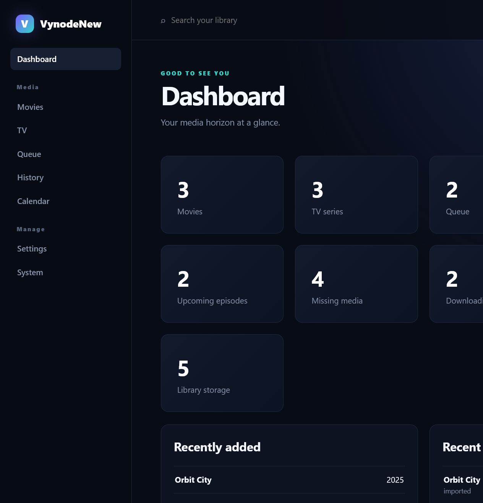
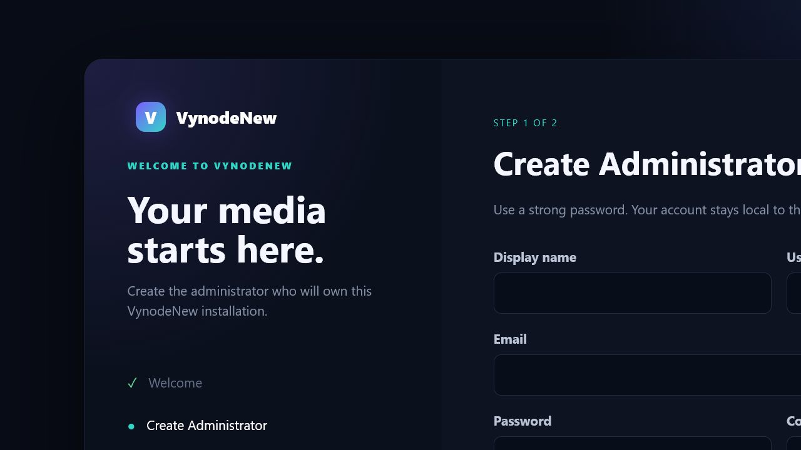

<p align="center">
  
</p>

<h1 align="center">VynodeArr</h1>

<p align="center">
  One self-hosted application for managing movies and television.
</p>

<p align="center">
  <a href="https://github.com/minerport/VynodeArr-Unified/releases/latest"></a>
  <a href="https://github.com/minerport/VynodeArr-Unified/actions/workflows/verify.yml"></a>
  <a href="LICENSE"></a>
  
</p>

VynodeArr combines movie and television acquisition, library management, monitoring, search, activity, and service configuration behind one consistent interface. Its bundled movie and television engines are installed, connected, and maintained automatically.



## Highlights

- Unified movie and television libraries with posters, fanart, details, monitoring, and independent saved layouts
- Automatic and interactive searches for movies, shows, seasons, and individual episodes
- Wanted views grouped by show and season, with availability and monitoring indicators
- Combined calendar, sortable download queue, history, and actionable health reporting
- Guided root-folder browser, quality profiles, indexers, download clients, and media-management forms
- First-run administrator creation, local users, roles, active sessions, and encrypted credentials
- Bundled and automatically connected movie and television engines
- Compatibility API ports for applications such as Seerr
- In-app configuration backup, download, upload, and restore workflows
- Responsive VynodeArr interface without exposing the bundled engines' original web interfaces

## Install on Unraid

VynodeArr uses one self-contained image:

```text
ghcr.io/minerport/vynodearr-unified:latest
```

1. Download the [latest Unraid template](https://github.com/minerport/VynodeArr-Unified/releases/latest) or import [`templates/vynodearr.xml`](templates/vynodearr.xml).
2. Keep `/config` mapped to `/mnt/user/appdata/vynodearr`.
3. Select writable host folders for `/movies`, `/tv`, and `/downloads`.
4. Install the container and open the WebUI on port `8686`.
5. Create the first administrator account.
6. Add indexers and download clients under **Service Settings**.

The movie and television engines are initialized and connected automatically. Do not delete `/config` when updating the container; it contains accounts, settings, engine databases, and other persistent state.

### Unraid paths and ports

| Container location | Purpose | Suggested Unraid mapping |
|---|---|---|
| `/config` | Application accounts, settings, databases, and backups | `/mnt/user/appdata/vynodearr` |
| `/movies` | Movie library | `/mnt/user/media/movies` |
| `/tv` | Television library | `/mnt/user/media/tv` |
| `/downloads` | Shared download-client data | `/mnt/user/downloads` |
| `8686` | VynodeArr WebUI | Required |
| `7878` | Movie compatibility API | Optional, for request applications |
| `8989` | Television compatibility API | Optional, for request applications |

For normal Unraid HTTP access, keep `VYNODEARR_SECURE_COOKIES=false`. Set it to `true` only when VynodeArr is always accessed through HTTPS.



## Install on Windows

Windows 10 or 11 x64 and Docker Desktop with Linux containers are required.

1. Download `VynodeArr-Windows-x64-<version>.zip` from the [latest release](https://github.com/minerport/VynodeArr-Unified/releases/latest).
2. Extract the archive to a permanent folder.
3. Run `Start-VynodeArr.ps1`.
4. Open [http://localhost:8686](http://localhost:8686) and create the first administrator.

Run `Stop-VynodeArr.ps1` to stop the application without removing its data.

## First steps

After signing in:

1. Open **Service Settings → Root Folders** and confirm the movie and television locations.
2. Configure quality profiles for each library.
3. Add indexers and a download client.
4. Use **Add Media** to search for a movie or show and choose its folder, profile, and monitoring behavior.
5. Check **Health** on the dashboard for configuration issues and direct links to resolve them.

## Connecting Seerr and other request applications

Use the VynodeArr server's address with the compatibility ports:

- Movies: `http://YOUR-SERVER-IP:7878`
- Television: `http://YOUR-SERVER-IP:8989`

Administrators can reveal or generate each engine API key from **Account Settings → Engines**. If a key is regenerated, update every external application that uses it.

## Updates and data protection

- On Unraid, update or force-update the container to pull the latest image.
- Keep the `/config` mapping when recreating or updating the container.
- Before uninstalling, create and download both backups from **System → Backups**.
- A fresh installation can upload and restore previously downloaded backup files.
- Media files remain in the mapped `/movies` and `/tv` locations and are not stored inside the container.

## Troubleshooting

### I am signed out immediately after login

Update to the latest image and ensure `VYNODEARR_SECURE_COOKIES=false` when accessing the WebUI over HTTP. If necessary, clear cookies for the server address and sign in again.

### An engine or integration shows unhealthy

Select **Health** on the dashboard. Movie and television issues are separated and include links to the applicable root-folder, indexer, download-client, quality-profile, storage, or advanced settings page.

### A local download client cannot be reached

Inside a container, `localhost` refers to that container—not the Unraid host. Use the host's LAN IP address and ensure the download client listens on an address accessible from the Docker network.

### Artwork is missing

Use **Refresh & scan** for the affected title and confirm both bundled engines report healthy. Artwork is proxied through the authenticated VynodeArr gateway.

## Development

```powershell
Copy-Item .env.example .env
docker compose up --build -d
```

The development interface opens at [http://localhost:4310](http://localhost:4310).

Run the full verification suite with:

```text
npm run verify
```

Architecture and implementation documentation is available in [`docs/`](docs/). Start with:

- [VynodeArr architecture](docs/VYNODEARR_ARCHITECTURE.md)
- [Authentication and accounts](docs/AUTHENTICATION.md)
- [Management gateway](docs/N4_MANAGEMENT_GATEWAY.md)
- [Interaction parity](docs/N5_INTERACTION_PARITY.md)
- [Packaging and licensing](docs/PACKAGING_AND_LICENSING.md)

## License and acknowledgements

VynodeArr source code is licensed under the [Apache License 2.0](LICENSE). Bundled third-party components retain their own licenses and notices; see [`THIRD_PARTY_NOTICES`](THIRD_PARTY_NOTICES).
