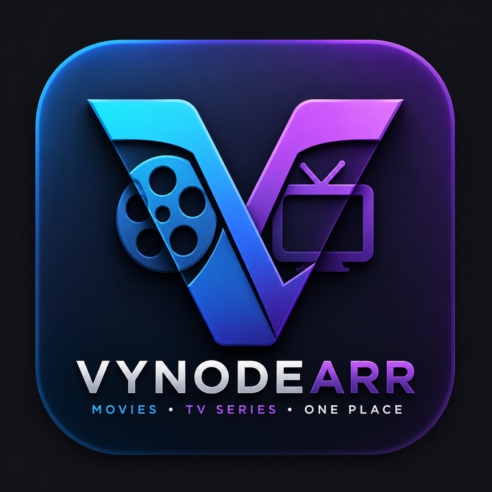
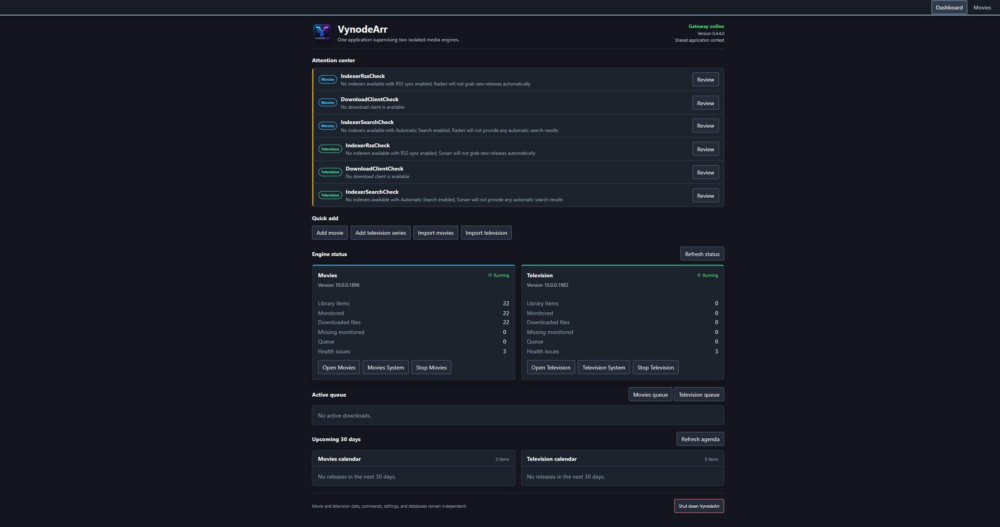
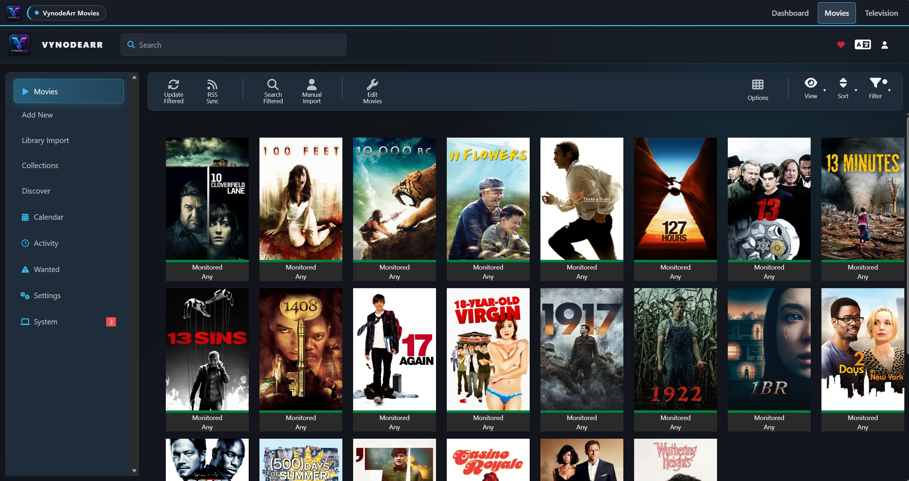

# VynodeArr

<p align="center">
  
</p>

<p align="center">
  <strong>Movies and television. One self-hosted application.</strong>
</p>

<p align="center">
  <a href="https://github.com/minerport/VynodeArr-Unified/releases/latest"></a>
  <a href="https://github.com/minerport/VynodeArr-Unified/actions/workflows/ci.yml"></a>
  <a href="LICENSE"></a>
  <a href="https://github.com/minerport/VynodeArr-Unified/pkgs/container/vynodearr-unified"></a>
</p>

VynodeArr combines complete movie and television library management behind one dashboard, one login, and one public port. The two media engines remain operationally isolated, with separate databases, settings, queues, commands, logs, API keys, and persistent data.

> [!IMPORTANT]
> VynodeArr is under active development. Back up your configuration before upgrading. Update VynodeArr as a complete package; native engine self-updates are not supported.

## Why VynodeArr?

- **One control center** for movies and television
- **One login** across the dashboard and both media interfaces
- **One public port** with private, loopback-only engine processes
- **Independent media domains** that do not share databases or settings
- **Unified visibility** for health, queues, missing media, downloads, and upcoming releases
- **Cross-platform packages** for Windows x64, Linux x64, Docker x86-64, and Unraid x86-64
- **Third-party API compatibility** through gateway-proxied movie and television endpoints
- **Coordinated lifecycle management** that starts and stops the gateway and both engines together

## Screenshots

| Dashboard | Movies |
| --- | --- |
|  |  |

<p align="center">
  <em>The interface is responsive across desktop, tablet, and mobile layouts.</em>
</p>

## Supported platforms

| Platform | Status | Installation |
| --- | --- | --- |
| Windows x64 | Supported | GitHub Release installer |
| Linux x64 | Supported | Versioned archive and systemd installer |
| Docker x86-64 | Supported | GHCR image |
| Unraid x86-64 | Supported | Community Applications template |
| Linux ARM64 | Not yet supported | Packaging exists, runtime validation pending |
| macOS | Not currently supported | No release package |

See the complete [platform support and installation notes](docs/PLATFORM_INSTALLATION.md).

## Install

### Windows

1. Download `VynodeArr-<version>-win-x64-setup.exe` from the [latest release](https://github.com/minerport/VynodeArr-Unified/releases/latest).
2. Run the installer.
3. Open [http://127.0.0.1:8686](http://127.0.0.1:8686).
4. Create the first administrator account.

The installer creates one Windows service, desktop and Start menu shortcuts, and one notification-area controller. Uninstall removes the application but preserves configuration and databases under `C:\ProgramData\VynodeArr`.

### Linux x64

Download the current archive and checksum from the [latest release](https://github.com/minerport/VynodeArr-Unified/releases/latest), then:

```bash
sha256sum --check VynodeArr-<version>-linux-x64.tar.gz.sha256
tar -xzf VynodeArr-<version>-linux-x64.tar.gz
cd VynodeArr-linux-x64
sudo ./install.sh
```

Open `http://LINUX_HOST:8686`. The installer creates a dedicated `vynodearr` account, installs the application under `/opt/vynodearr`, stores persistent data under `/var/lib/vynodearr`, and enables one systemd service.

Detailed Linux installation, permissions, upgrades, and removal instructions are available in the [Linux package guide](distribution/linux/README.md).

### Docker

The supported container image is:

```text
ghcr.io/minerport/vynodearr-unified:latest
```

A versioned tag such as `0.4.9` may be used when a deployment must remain pinned. Start with the supported [Compose example](distribution/docker/compose.yml) and replace every media path before launching it:

```bash
export VYNODEARR_CONTROL_KEY="$(openssl rand -hex 32)"
docker compose -f distribution/docker/compose.yml up -d
```

Never reuse existing Radarr or Sonarr appdata as VynodeArr's `/config` directory.

### Unraid

Install **VynodeArr** from Community Applications, or load the canonical [Unraid template](templates/vynodearr.xml) as a user template.

| Container path | Typical Unraid path | Purpose |
| --- | --- | --- |
| `/config` | `/mnt/user/appdata/vynodearr` | VynodeArr configuration and databases |
| `/movies` | `/mnt/user/movies` | Movie library |
| `/tv` | `/mnt/user/tv` | Television library |
| `/downloads` | `/mnt/user/downloads` | Download-client files |

The template follows the `latest` supported image and runs as Unraid `nobody:users` (`99:100`). All mapped directories must be writable by that identity. Generate the required lifecycle control key with:

```bash
openssl rand -hex 32
```

If other media managers use the same download client, assign dedicated categories such as `vynode-movies` and `vynode-tv`.

## First-run paths

After installation:

- Dashboard: `http://VYNODEARR_HOST:8686/`
- Movies: `http://VYNODEARR_HOST:8686/movies/`
- Television: `http://VYNODEARR_HOST:8686/television/`
- Health check: `http://VYNODEARR_HOST:8686/health`

The first visit redirects to `/setup`, where the initial administrator account is created.

## Connecting other applications

Applications that normally integrate with Radarr or Sonarr can connect through VynodeArr without exposing either private engine port.

| Service type | Hostname or IP | Port | URL base |
| --- | --- | --- | --- |
| Movies | VynodeArr host | `8686` | `/movies` |
| Television | VynodeArr host | `8686` | `/television` |

Use the API key displayed by the corresponding engine under **Settings → General → Security**. Movie and television API keys are intentionally separate.

On Docker or Unraid, do not use `127.0.0.1` from another container; it refers to that container itself. Use the Unraid server address, VynodeArr container name on a shared Docker network, or another resolvable hostname.

Only native API routes under `/movies/api/*` and `/television/api/*` accept engine API-key authentication. Dashboard pages and non-API routes require the VynodeArr login.

## Architecture and isolation

```text
Browser and API clients
          |
          v
VynodeArr Gateway :8686
  |-- /                    Unified dashboard
  |-- /movies/*            Movie interface and API proxy
  |-- /television/*        Television interface and API proxy
  `-- /api/unified/v1/*    Unified status and lifecycle API
          |
          |-- Movies engine      private process + private data
          `-- Television engine  private process + private data
```

VynodeArr keeps these boundaries intact:

- separate movie and television databases;
- separate configuration, logs, queues, commands, and API keys;
- private engine listeners accessible only through the gateway;
- coordinated startup and shutdown without merging engine behavior;
- locked and traceable engine source revisions.

The exact engine revisions are recorded in [`distribution/source-lock.json`](distribution/source-lock.json). More detail is available in the [architecture](docs/ARCHITECTURE.md), [source inventory](docs/SOURCE_INVENTORY.md), and [authenticated control center](docs/AUTHENTICATED_CONTROL_CENTER.md) documentation.

## Media permissions and imports

VynodeArr can use any media location its service or container account can read and write. Linux and Unraid permissions are enforced by the operating system; VynodeArr does not impose a hard-coded folder allowlist.

Movie Library Import expects one directory per movie:

```text
/movies/Movie Title (Year)/movie-file.mkv
```

Loose movie files placed directly in the library root are not import candidates.

## Updating

Update the complete VynodeArr package:

- **Windows:** install the newer release over the existing installation.
- **Linux:** download the newer archive and rerun `sudo ./install.sh`.
- **Docker/Unraid:** pull or force-update the `latest` image and recreate the container.

Configuration and databases are stored outside the application payload and are preserved during normal upgrades. Back them up before every upgrade.

Do not use the native Movies or Television update functions. VynodeArr releases package and validate both locked engines as one compatible set.

## Development

Requirements:

- .NET SDK selected by [`global.json`](global.json)
- PowerShell
- reviewed movie and television engine sources for full packages
- Inno Setup 7 and Windows x64 for the Windows installer

Build and test the gateway:

```powershell
dotnet restore VynodeArr.Unified.sln
dotnet build VynodeArr.Unified.sln --configuration Release --no-restore
dotnet test VynodeArr.Unified.sln --configuration Release --no-build
dotnet run --project src/VynodeArr.Gateway
```

Generated packages are written under `artifacts/` and are not committed. Maintainers should follow the [Windows installer guide](docs/WINDOWS_INSTALLER.md), [cross-platform review](docs/CROSS_PLATFORM_REVIEW.md), and [contribution requirements](CONTRIBUTING.md).

## Security

Review [`SECURITY.md`](SECURITY.md) before exposing VynodeArr outside a trusted network. Report vulnerabilities privately through the process described there rather than opening a public issue.

## License and acknowledgements

VynodeArr and its locked movie and television sources are distributed under the [GNU General Public License v3.0](LICENSE). Preserve upstream copyright and license notices when redistributing engine payloads.

VynodeArr is an independent project and is not affiliated with or endorsed by the Radarr or Sonarr projects.
