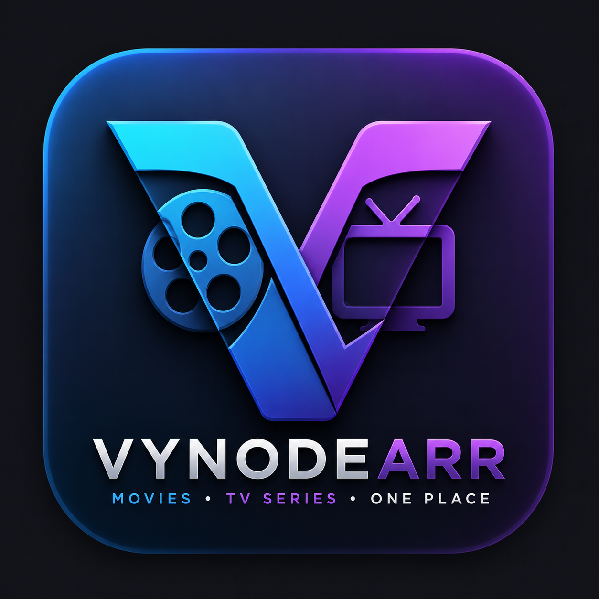
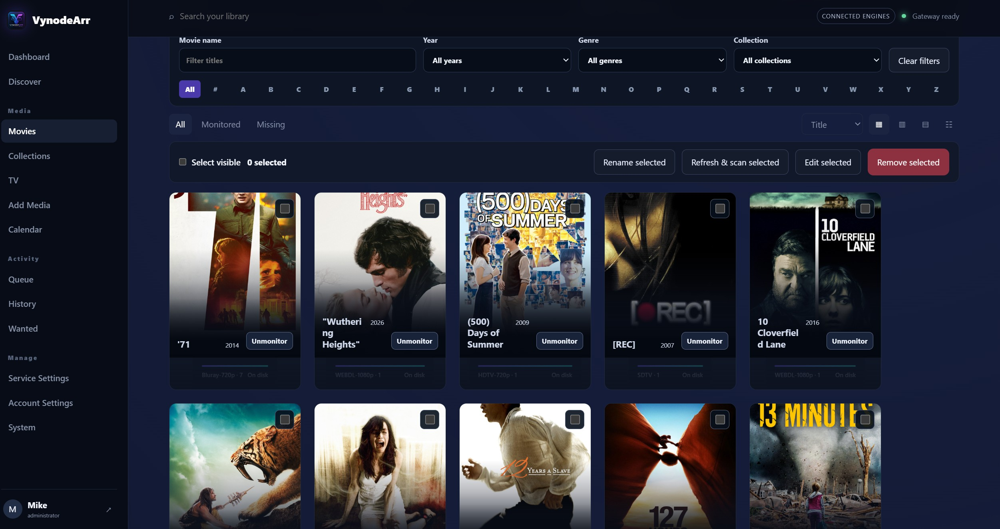
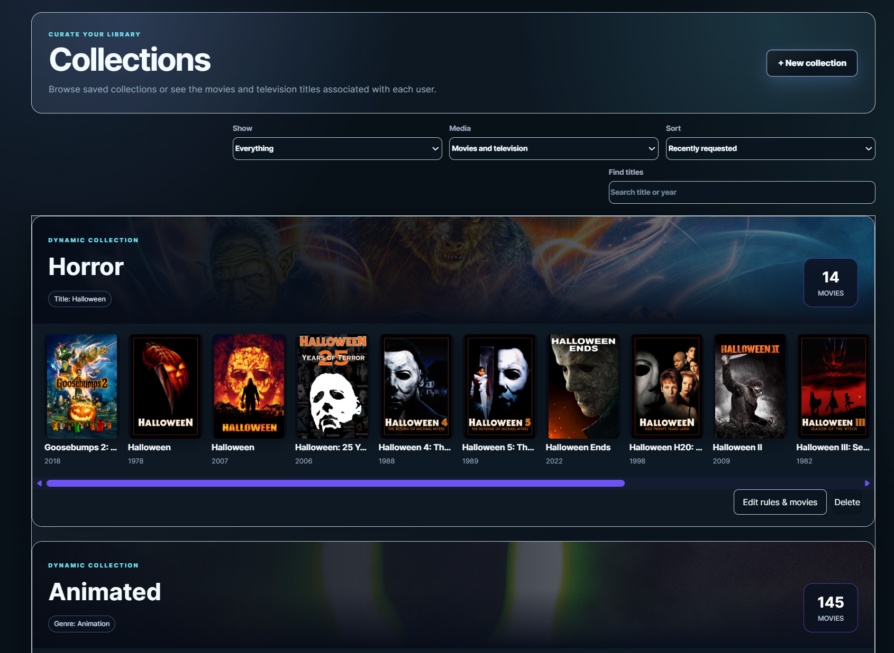

<p align="center">
  
</p>

<h1 align="center">VynodeArr</h1>

<p align="center">
  Movies and television, managed together.
</p>

<p align="center">
  <a href="https://github.com/minerport/VynodeArr-Unified/releases/latest"></a>
  <a href="https://github.com/minerport/VynodeArr-Unified/actions/workflows/verify.yml"></a>
  <a href="LICENSE"></a>
  
</p>

VynodeArr is a self-hosted media-management application that runs
[Radarr](https://github.com/Radarr/Radarr) and
[Sonarr](https://github.com/Sonarr/Sonarr) behind a unified interface and secure
gateway. These long-running open-source projects provide the dedicated movie
and television engines; VynodeArr brings their library management, discovery,
monitoring, acquisition, activity, and administration workflows into one
consistent experience and account system.



## Current release

Version **2.0.35** is available for production use on Unraid, Windows, and
standard Docker installations. Version **2.0.35-rc.11** is available as a
prerelease with a durable local Movie and Television catalog, targeted
event-driven updates, server-side paging, performance controls, and persistent
artwork caching that reduce engine CPU and network load while preserving
current library information and poster overlays. Persisted synchronization
health now survives restarts, and a temporary engine or attention-summary
failure keeps the durable catalog available instead of replacing the library
with a generic load failure. RC.6 adds per-engine circuit breakers, prioritized
and deduplicated synchronization queues, catalog integrity diagnostics, and
safe administrator retry and rebuild controls that preserve the last usable
catalog until a complete replacement is ready. Engine requests are now
concurrency-limited and shared across operational readers, while import bursts
are reconciled after a quiet period to reduce SQLite lock contention and engine
thread-pool pressure on large libraries. RC.7 makes background interface
refreshes visibility-aware, prevents polling and navigation from shifting the
visible page, groups Service Settings without removing routes, clarifies
Action Center and Automation Timeline behavior, and standardizes accessible
desktop and mobile dialogs without removing any controls. It also includes the Engine
Update Center and its backup-gated
candidate workflow. The new administrator Library Action Center identifies operational
issues, explains their impact, recommends a safe next action, and provides a
unified Automation Timeline across requests, searches, downloads, queue and
history events, notifications, audits, validation, and Plex artwork, with a
phone-friendly filter and event layout. Its
Poster Overlay Studio adds reusable,
variable-aware text, shape, and media-icon layers; precise positioning and
resizing; adaptive colors; conditional rendering; text wrapping and automatic
fitting; exact VynodeArr previews; reversible library assignments; expanded
movie-file metadata; season, next-episode, and latest-episode variables; and
multi-rule AND/OR layer conditions. Conditional style variants can optionally
change colors, shapes, icon appearance, font weight, and adaptive contrast when
metadata matches, with independent ranked formatting and fully scrollable editor
controls. This stable release is published as the `latest` image.

The administrator Validation Center checks
engine connectivity, storage, acquisition providers, scheduled automation,
credentials, notifications, and application data after startup, updates, and
restores. It provides guided fixes plus guarded re-synchronization and managed
connection repair.

## How library data stays current

VynodeArr keeps a durable SQLite projected catalog of the Movie and Television
engines. Opening either library reads that local verified projection, so normal
navigation, server-side search, filtering, sorting, and progressive pages do not
repeatedly ask an engine to return every title. All existing
library cards, filters, details, actions, artwork, request attribution, and
poster overlays continue to use the same engine-backed data and permissions.

Changes made through VynodeArr reconcile only the affected title. Managed native
engine webhooks, engine import history, and mounted-library filesystem changes
enter a restart-safe, deduplicated background queue for targeted
reconciliation, while a full integrity sweep runs every six hours to recover
changes made directly in an engine or on disk. Administrators can also use
**Sync now** on a library page for immediate recovery. If an engine is
temporarily unavailable, VynodeArr retains the last good projection instead of
emptying the library.

The following optional environment values control this behavior:

- `VYNODEARR_SYNC_INTERVAL_MS` changes the full integrity interval.
- `VYNODEARR_LIBRARY_WATCH_ENABLED=false` disables mounted-library monitoring.
- `VYNODEARR_MOVIE_LIBRARY_PATH` and `VYNODEARR_TV_LIBRARY_PATH` override the
  watched container paths (normally `/movies` and `/tv`).

Administrators can use **System → Performance** to review application memory,
catalog and event health, artwork queues, and the most expensive API routes.
Library page size, event-worker concurrency, artwork concurrency, and the full
integrity interval can be adjusted there without restarting the application.

The Download Decision Center explains why returned releases were selected,
accepted, or rejected using native engine evidence for quality, custom formats,
preferred words, size, age, seeders, and upgrade eligibility. Candidate history
is filterable, mobile friendly, retained across restarts, and included with
optional application backup history.

Administrators can also download a portable,
password-encrypted VynodeArr application backup containing accounts,
permissions, requests, notification configuration and templates, protected
credentials, collections, and application settings. Recovery includes a
contents preview, explicit confirmation, and an automatic encrypted
pre-restore safety archive. Native Movies and Television backups remain
separate so both application and engine state can be recovered intentionally.

Discord, Telegram, and Gotify delivery
includes a visual template builder with friendly title and message fields,
reusable event tokens, live previews, and an optional validated JSON editor for
provider-specific payloads. Discord supports custom accent colors and Gotify
supports adjustable priority, while credentials and Telegram chat routing stay
protected by the server.

Pushover delivery adds protected application and user keys, optional device
targeting, Silent through Emergency priorities, emergency retry controls,
message expiration, custom sounds, and optional Sonarr-compatible end-to-end
encryption. It shares the same category routing, visual templates, testing,
delivery history, retry, backup, restore, validation, and audit workflows.

The responsive builder is a full desktop dialog and a compact mobile bottom
sheet with sticky actions, internal scrolling, and safe-area support. Its
preview remains completely visible at phone widths, including when advanced
JSON is enabled.

Notifications and administrator user requests now provide explicit individual
and bulk mark-read controls. Read state synchronizes across both surfaces while
preserving durable history. Releases selected through Movie interactive search
also enter Search Activity, generate a grabbed notification, and continue
through Queue and History reconciliation toward import.

Collections can also be viewed by requester. Administrators can select
Everything, saved Collections, or an individual user, while regular users see
only their own requested and saved Movies and Television. Existing library
titles can be added to a personal collection without creating another download
request, and request attribution remains synchronized with corrected matches.
User collection owners can keep their shelf private, share it with the household
or selected users, sort and search it, review completion and storage statistics,
run permission-aware bulk library actions, inspect the full request-to-import
timeline, and transfer matching titles through JSON or CSV. Requester attribution
also follows matching media through Queue, History, Wanted, and download decisions.

The desktop activity drawer provides a wider, overflow-safe settings workspace
with an explicit close action and responsive channel rows. Movie organization
also keeps engine-known files visible when a folder must move first, then
recalculates and applies the active filename format immediately after that move
without requiring a separate refresh and second rename operation.

The global notification center provides a
durable Inbox and History for request decisions, downloads, imports, engine
health, security, and automatic searches. Operational alerts are deduplicated,
remain available after reading, and resolve in place when the underlying issue
clears.

Users can choose notification categories, minimum severity, and UTC quiet
hours. Administrators can define defaults and configure encrypted external
delivery through Discord webhooks, Telegram, or Gotify. Each channel supports
category routing, masked credentials, test delivery, failure history, and
manual retry. External provider outages never interrupt media operations or
the in-app activity center.

Administrators also have a persistent **Search Activity** center inside the
notification bell for Movie and Television automatic searches. It shows the
real path from queued and searching through grabbed, downloading, and imported,
with posters, engine status, bulk-search counts, and direct links to Queue and
title details.

Search Activity follows matching engine Queue and History records through
download completion and confirmed library import. Completed commands continue
reconciling for delayed results, and searches initiated by user requests remain
visible to administrators. Request notifications also remain as readable
history after approval or rejection while sidebar badges count only decisions
that still require action.

Automatic-search activity covers new library additions, Discover requests,
whole-show, season, episode, Wanted, and Search All Missing workflows. Native
Movie and Television add options are preserved so monitoring scope and
immediate searches reach the correct engine. On phones, Search Activity becomes
a compact bottom sheet without removing stages or actions.

Phone-sized movie and television details now
keep artwork, title information, and controls aligned without clipping. All
title actions remain available through a compact horizontal rail, while
television season and episode controls expand only when requested.

Discover now uses official TMDB company and network logos for studio and
network browsing. Genre cards use stable custom artwork and color treatments
instead of changing whenever a different title becomes popular.

Discover identifies existing library titles
by authoritative TMDB, TVDB, and IMDb identifiers, preventing alternate titles
or localized names from appearing available to request when they are already
managed.

Administrators now have a dedicated **Library Health** subpage under Service
Settings. It reports identity, duplicate, metadata, artwork, storage,
monitoring, missing-media, and quality-cutoff findings, then routes each finding
to the existing title, Wanted, or Root Folders workflow that can resolve it.
Diagnostics remain available independently from engine media-management
settings and clearly explain when the connected engine cannot provide them.

The authenticated interface remains optimized for phone-sized displays without
removing desktop capabilities or information.
Navigation, settings sections, media libraries, detail views, queue controls,
forms, and dialogs use touch-friendly responsive layouts with safe-area support.

The Calendar now shows the complete month without horizontal scrolling on a
phone. Compact date cells preserve Movie and TV activity through event counts
and color-coded dots, while the selected-day agenda retains posters and full
event details.

Real-device refinements keep detail modals inside the phone viewport, preserve
2:3 request and Wanted poster artwork, prevent library-card actions from
overlapping, and keep the navigation rail independently scrollable. History can
be narrowed to Movies or Television, while mobile headings and request-status
cards retain consistent spacing and alignment.

A global notification bell keeps request
activity visible from every page. Administrators are alerted when a request
needs approval, while users receive updates when their requests are approved,
declined, fail, or finish importing.

Unread notification state is stored per account and survives application
restarts. The bell includes a live unread count, a scrollable desktop and
mobile-safe activity panel, direct links to the relevant request page, and a
**Mark all read** action. Sidebar badges remain synchronized: **User Requests**
shows the live number awaiting approval, while **My Requests** shows unread
status updates.

Request-limit denials remain visible inside the Discover request modal so users
can understand why a title was not submitted.

Requests cancelled by their user now appear as **Cancelled by user** rather
than rejected in both personal and administrator history. A cancellation is
removed from the user's request-allowance usage immediately, allowing another
request whenever it brings the user below their configured threshold. Existing
self-cancelled history is recognized automatically.

Administrators can choose per User account whether Discover requests are added
automatically or require approval. Approval-required requests remain in
VynodeArr and do not reach the Movie or TV engine until an administrator
approves them.

The administrator-only **User Requests** page provides per-user request history,
search plus user, status, and media filters, and controls to approve and add or
decline pending titles with a required reason. Both administrator and user
request pages display posters, overviews, ratings, genres, runtime,
certification, and authoritative external IDs.

Administrators can also set independent daily, weekly, or monthly request
allowances for each User account, including separate Movie and TV limits and a
maximum number of pending requests. Limits can be changed, disabled, or left
unlimited at any time, are enforced by the server, and show users their
remaining allowance in Discover and My Requests.

The new administrator-only **System Audit** view makes security-sensitive and
operational activity reviewable in one place. It supports search and category
or administrator filtering across request decisions, account and access
changes, configuration, engines, backups, security, jobs, collections, media,
synchronization, exports, and guide-template operations.

Pending requests can be corrected by selecting an authoritative TMDB match or
cancelled before approval, downloading, or importing begins. Approval,
ownership, CSRF protection, current folder/profile configuration, and live
eligibility are validated by the server, while failures are explained without
exposing administrative engine or download-client details.

Discover requests resolve movie and television engine records using
authoritative TMDB and TVDB identifiers rather than title text or search-result
order. Users granted Discover access can correct a movie selection before
submitting the request by reviewing and choosing the intended TMDB record.

Page permissions are enforced in both the interface and API. Unavailable
navigation is hidden, direct links are rejected, live library updates are
filtered, and changes apply to sessions that are already signed in. A User
granted Calendar access can browse monitored movie releases and television air
dates without receiving access to administrator-only engine-management APIs.
Correcting a pending Discover request does not grant permission to alter
existing library items.

The Queue page now shows separate live totals for the Movie and TV engines,
along with the combined queue count. This release also continues the React and
TypeScript migration for Discover details and requests, background import
monitoring, and library-import review while retaining the existing workflows.

The release has been validated with the complete automated test suite,
TypeScript checking, production builds, bundle-budget checks, branding checks,
Docker Compose parsing, and deployment validation.
Existing installations can update with the
`ghcr.io/minerport/vynodearr-unified:latest` image while retaining their
persistent `/config` mapping.

See the [changelog](CHANGELOG.md) for the detailed list of changes.

## Why VynodeArr

| One place for your media | Familiar control without the clutter | Built for real libraries |
|---|---|---|
| Browse movies, shows, seasons, episodes, wanted items, queue, history, and calendar from one sidebar. | Use guided forms for folders, profiles, indexers, clients, imports, backups, and service settings. | Bulk-edit large libraries, import in the background, monitor at every level, and keep movie and TV preferences independent. |

## Feature tour

### Rich movie and television libraries

- Poster, information-card, compact-grid, and detailed-list layouts remembered independently for movies and television
- Engine-backed sorting by title, release date, rating, content rating, duration, date added, library size, availability, completion, and attention
- Artwork-backed detail pages with monitoring, search, refresh, edit, and location controls
- An administrator-only Poster Overlay Studio for reusable metadata badges and
  selected-title or whole-library VynodeArr poster styling. Assignments are
  reversible and preserve original artwork as a fallback. Administrators can
  securely validate a Plex server and discover its movie and television
  libraries, review TMDB/TVDB/IMDb matches, and compare current Plex posters
  with rendered results. Administrators can apply one reviewed poster at a
  time after typed confirmation; VynodeArr captures and integrity-checks the
  original artwork first and provides an immediate audited restore action.
- Movie filters for title, year, genre, and collection
- Show, season, and episode monitoring with color-coded availability
- Bulk profile, root-folder, availability, refresh, and removal actions
- Native Movie and Television Import Lists with guided provider setup, testing,
  enable/disable controls, manual synchronization, editing, and removal

### Personal interface presentation

- Ten color themes that remain independent from layout and surface treatment
- Glass, Solid, OLED, and High Contrast interface styles
- Comfortable and compact information density
- System-aware, reduced, or full motion
- Uniform themed cards, controls, dialogs, borders, backgrounds, and scrollbars
- Viewport-safe modals that return you to the same position on the originating page
- Automatic per-installation encryption keys for saved engine credentials
- Administrator-controlled credential-key rotation under **System → Security**

### Search, acquire, and follow progress

- Automatic and interactive search for movies, shows, seasons, and individual episodes
- Release results with quality, size, source, status, and rejection reasons
- Wanted views grouped by show and season
- Sortable, filterable queue with separate Movie/TV engine totals,
  download-client status, and bulk actions
- A personal **My Requests** page showing requested, searching, downloading,
  imported, failed, and rejected states from the live engines
- Pending-request correction by authoritative TMDB ID and safe cancellation
  before downloading or importing starts
- Unified calendar, history, health, and scheduled-task views

### User access controls

Administrators manage local accounts under **Account Settings → Users**. Each
User account can be granted any combination of:

- **Dashboard** — view system and library summaries
- **Discover** — browse and request movies or television series
- **Movies** — view the movie library and movie details
- **TV** — view shows, seasons, episodes, and series details
- **Calendar** — view upcoming movie and episode dates

Granting **Discover** access also exposes **My Requests**, where the user can
track their own requests and correct or cancel only those that remain eligible.
For each User, administrators can choose automatic approval or administrator
approval and optionally enforce daily, weekly, or monthly total, Movie, TV, and
pending-request limits. Blank allowance fields are unlimited, and limits can be
updated or disabled from the same account editor.

Dashboard, Movies, TV, and Calendar remain view-only for User accounts. Actions
that alter libraries, monitoring, files, engine configuration, providers,
activity, or system settings remain administrator-only. **My Account** is
always available so every signed-in user can maintain their own profile,
password, sessions, and interface preferences.

### Flexible collections

Build hand-picked collections or combine smart rules such as title, year, decade, genre, monitoring state, file availability, and an existing movie collection. Preview matches, keep earlier selections while trying new rules, and remove individual movies before saving.



### Administration without configuration files

- First-run administrator creation and secure local accounts
- Administrator and configurable User roles, active sessions, encrypted credentials, and engine-key controls
- Visual root-folder browser, quality profiles, indexers, and download clients
- Review, customize, compare, and apply TRaSH guide templates independently for Movies and TV
- Movie and television settings kept separate where their behavior differs
- Backup creation, download, upload, and restore from the VynodeArr interface
- Searchable and filterable System Audit history for administrative, request,
  security, configuration, engine, backup, job, collection, and media activity
- Post-update and recovery validation for engine connections, storage,
  providers, automation, credentials, notifications, and application data,
  with guided fixes and guarded safe repairs
- Download Decision Center evidence explaining accepted, rejected, and selected
  releases using engine-native rejection reasons and ranking metrics
- Actionable health issues with direct links to the setting that needs attention

## Install

| Platform | Best for | Start here |
|---|---|---|
| Unraid | Always-on media servers | Use the Community Apps template or [`templates/vynodearr.xml`](templates/vynodearr.xml) |
| Windows 10/11 x64 | Desktop installation or a Windows host | Download the Windows archive from the [latest release](https://github.com/minerport/VynodeArr-Unified/releases/latest) |

### Unraid

The container image is:

```text
ghcr.io/minerport/vynodearr-unified:latest
```

1. Install VynodeArr from Community Apps, or import [`templates/vynodearr.xml`](templates/vynodearr.xml).
2. Keep `/config` mapped to a persistent appdata folder.
3. Map writable movie, television, and download folders.
4. Open the WebUI on port `8686`.
5. Create the first administrator.
6. Confirm root folders, then add indexers and download clients under **Service Settings**.

| Container path | Purpose | Example Unraid path |
|---|---|---|
| `/config` | Accounts, settings, databases, and backups | `/mnt/user/appdata/vynodearr` |
| `/movies` | Movie library | `/mnt/user/media/movies` |
| `/tv` | Television library | `/mnt/user/media/tv` |
| `/downloads` | Shared completed-download data | `/mnt/user/downloads` |
| `8686` | VynodeArr WebUI and compatibility gateway | Required |

> Keep `/config` when updating or recreating the container. It contains the application state and both service databases.

For normal Unraid HTTP access, leave `VYNODEARR_SECURE_COOKIES=false`. Enable secure cookies only when VynodeArr is always accessed over HTTPS.

### Credential encryption and master-key rotation

When neither `VYNODEARR_MASTER_KEY` nor `VYNODEARR_MASTER_KEY_FILE` is
configured, VynodeArr generates a unique cryptographically random master key
on first run. It is retained as `master-key` inside the persistent
`VYNODEARR_DATA_DIR` (normally `/config/vynodearr` in the container). Keep the
`/config` mapping to retain access to encrypted movie-engine, television-engine, and discovery
credentials.

Administrators can open **System → Security** and choose **Rotate master key**.
VynodeArr re-encrypts the existing credential vault and persists the new key;
this does not change the API keys configured inside either media engine. An
interrupted rotation is completed automatically on the next startup.

Installations that explicitly provide `VYNODEARR_MASTER_KEY` or
`VYNODEARR_MASTER_KEY_FILE` remain externally managed. For those installations,
the in-app rotation control is disabled so a container restart cannot restore
an older environment value over an app-generated replacement.

### Engine authentication on Docker networks

Bundled movie and television engines require API-key authentication from every
address by default. This includes VynodeArr, request applications, and other
containers sharing the Docker network. VynodeArr continues using the generated
engine API keys automatically.

Administrators can review or change each engine independently under
**Account Settings → Media Engines → Require engine authentication**. Keep the
switch enabled unless the Docker network is trusted and isolated. When it is
disabled, local-address rules may treat other containers as local and allow
them to reach that engine without authentication.

### Windows

Docker Desktop with Linux containers is required.

1. Download `VynodeArr-Windows-x64-<version>.zip` from the [latest release](https://github.com/minerport/VynodeArr-Unified/releases/latest).
2. Extract it to a permanent folder.
3. Run `Start-VynodeArr.ps1`.
4. Open [http://localhost:8686](http://localhost:8686).
5. Create the first administrator and complete the same guided setup.

Run `Stop-VynodeArr.ps1` to stop VynodeArr without removing its data.

## First-run checklist

1. Open **Service Settings → Root Folders** and confirm the movie and television locations.
2. Review the quality profiles for each library.
3. Optionally review recommended settings under **Service Settings → Guide Templates**.
4. Add at least one indexer and download client.
5. Ensure the same completed-download folder is visible to VynodeArr and the download client.
6. Add or import media and choose monitoring behavior.
7. Open **Health** from the dashboard to resolve any remaining setup issues.

## Connect Seerr or another request application

Use the VynodeArr server address and port `8686` for both services:

| Service | URL base |
|---|---|
| Movies | `/movies` |
| Television | `/tv` |

Administrators can reveal or generate the individual API keys under **Account Settings → Engines**. Regenerating a key requires updating every external application that uses it.

## Updates, backups, and removal

- On Unraid, update the container to pull the newest image.
- Never remove the persistent `/config` mapping during an update.
- Administrators can use **System → Updates** to review official movie and
  television engine releases. VynodeArr blocks prereleases, downgrades,
  unexpected archives, unhealthy connections, and unsafe storage states before
  preparing a candidate.
- Engine candidates are built through a separate GitHub Actions workflow using
  exact reviewed versions. The complete container must pass verification and a
  health smoke test, is published only under an isolated `engine-candidate-*`
  tag, and never replaces `latest`. Keep the displayed rollback image until
  post-update validation succeeds.
- Download an encrypted **VynodeArr application backup** from **System →
  Backups** before uninstalling. It protects accounts, permissions, requests,
  notification channels and templates, saved credentials, collections, and
  application settings. Keep its password separately; it cannot be recovered.
- Create and download both native engine backups from the same page. A new
  installation can inspect and restore the application archive, then upload
  the Movies and Television backups to their matching sections.
- Library media remains in `/movies` and `/tv`; it is not stored inside the application container.

### Restore existing movie and TV engine backups

Native backups from an existing installation can be restored through
**System → Backups**:

1. Upload the native movie-engine backup with **Upload & restore** under **Movies backups**.
2. Wait for the Movies engine to restart and reconnect.
3. Upload the native TV-engine backup under **Television backups**.
4. Wait for the TV engine to restart and reconnect.

The backups are restored separately and must be uploaded to their matching
sections. Supported uploads are `.zip`, `.db`, and `.xml` files up to 500 MB.
Restoring an engine backup replaces only that engine's configuration. Restore
accounts and application-level settings from the separate encrypted VynodeArr
application archive; it deliberately excludes active login sessions and media
files, and requires an application restart after recovery.

After restoring, verify root folders and download paths because paths from the
old installation must also exist inside the new container or be remapped.
See [Backup and Restore](docs/BACKUP_AND_RESTORE.md) for the complete migration
and verification procedure.

## Troubleshooting

<details>
<summary><strong>I am signed out immediately after login</strong></summary>

Update to the latest image and use `VYNODEARR_SECURE_COOKIES=false` when accessing VynodeArr over HTTP. Clear cookies for the server address before signing in again.
</details>

<details>
<summary><strong>A service or integration is unhealthy</strong></summary>

Open **Health** from the dashboard. Movie and television issues are separated and link directly to the applicable root-folder, indexer, download-client, quality-profile, storage, or advanced setting.
</details>

<details>
<summary><strong>A download completed but cannot be imported</strong></summary>

The download client and VynodeArr must see the completed folder through compatible container paths. Confirm that `/downloads` maps to the host folder used by the client, and review remote path mappings when the applications use different paths.
</details>

<details>
<summary><strong>A local service cannot be reached</strong></summary>

Inside a container, `localhost` refers to that container, not the Unraid host. Use the host LAN address or a shared Docker network address and make sure the target service listens on that interface.
</details>

<details>
<summary><strong>Artwork is missing</strong></summary>

Run **Refresh & scan** for the affected title and check **Health** for connectivity or storage issues. Artwork is served through the authenticated VynodeArr gateway.
</details>

## Development

```powershell
Copy-Item .env.example .env
docker compose up --build -d
```

The development interface opens at [http://localhost:4310](http://localhost:4310).

Run the full verification suite:

```text
npm run verify
```

More documentation:

- [Changelog](CHANGELOG.md)
- [Architecture](docs/VYNODEARR_ARCHITECTURE.md)
- [Authentication and accounts](docs/AUTHENTICATION.md)
- [Backup and restore](docs/BACKUP_AND_RESTORE.md)
- [Using guide templates](docs/GUIDE_TEMPLATES.md)
- [Management gateway](docs/N4_MANAGEMENT_GATEWAY.md)
- [Interaction parity](docs/N5_INTERACTION_PARITY.md)
- [Packaging and licensing](docs/PACKAGING_AND_LICENSING.md)

## License and acknowledgements

VynodeArr's own source code is licensed under the
[Apache License 2.0](LICENSE). That license badge applies only to VynodeArr
code; it does not relicense bundled or separately distributed components.

The Unraid image includes executable distributions of
[Radarr](https://github.com/Radarr/Radarr) and
[Sonarr](https://github.com/Sonarr/Sonarr), which remain licensed under the
GNU General Public License version 3 and retain their own copyrights, licenses,
and corresponding-source links. VynodeArr is grateful to both projects and
their contributors for the years of work behind its movie and television
engines. See [`OPEN_SOURCE_NOTICES`](OPEN_SOURCE_NOTICES) and
[`THIRD_PARTY_NOTICES`](THIRD_PARTY_NOTICES) for component versions, source
links, and additional notices.
